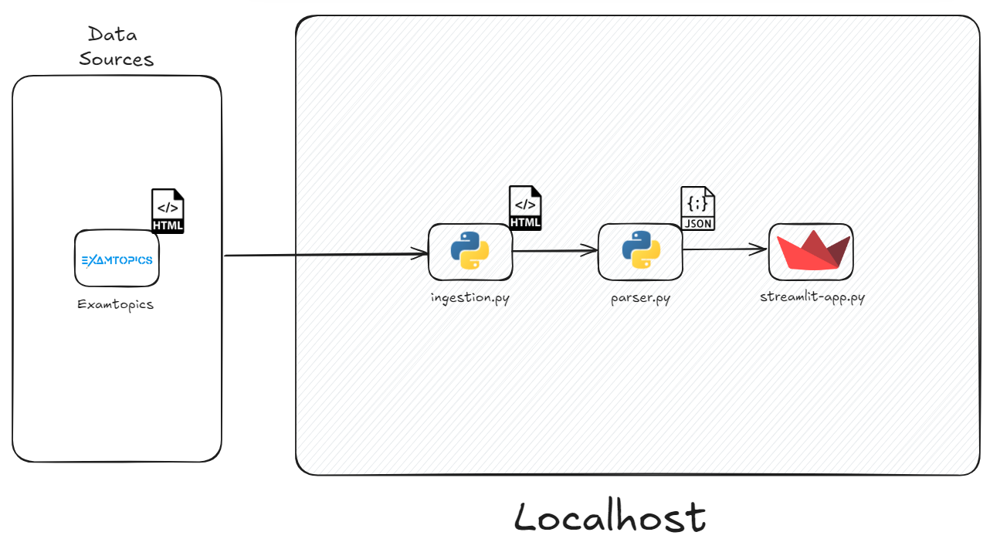
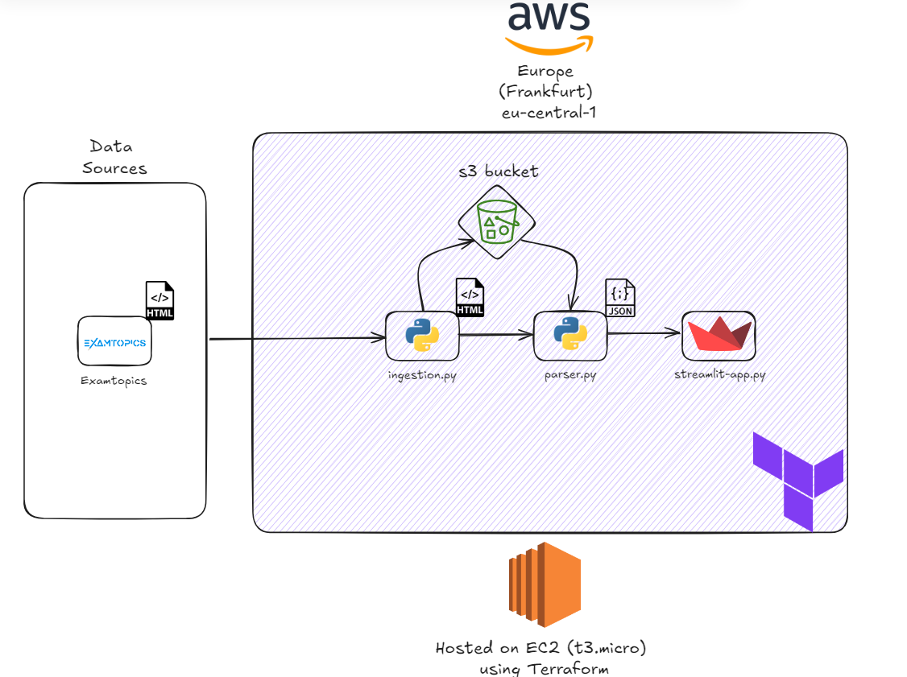

# ExamTopics Scraper and Streamlit Quiz App

This project provides a local setup for creating and running a quiz application based on [ExamTopics](https://www.examtopics.com/) questions. It includes web scraping, data parsing, and an interactive Streamlit Quiz App.


## Architecture diagram

### Localhost


_Diagram created using [Excalidraw](https://excalidraw.com/)._

1. Data is sourced from [ExamTopics](https://www.examtopics.com/) in HTML format.
2. ingestion.py script pulls the HTML data and saves it locally
3. parser.py processes the HTML and converts it to JSON.
4. streamlit_app.py serves the processed data through a web interface using [Streamlit](https://streamlit.io/).
5. The entire process runs on localhost.

### Cloud deployment

_Diagram created using [Excalidraw](https://excalidraw.com/)._

1. Data is sourced from [ExamTopics](https://www.examtopics.com/) in HTML format.
2. ingestion.py script pulls data into an S3 bucket.
3. parser.py processes the HTML files and converts them to JSON.
4. streamlit_app.py serves the processed data through a web interface using [Streamlit](https://streamlit.io/).
5. The entire system is hosted on an EC2 t3.micro instance, deployed using Terraform.

## Project Structure
📦ExamTopicsPoC
 ┣ 📂documentation
 ┃ ┗ 📂images
 ┃ ┃ ┣ 📜cloud_architecture.png
 ┃ ┃ ┗ 📜localhost_architecture.png
 ┣ 📂html_pages
 ┃ ┣ 📂aws_test
 ┃ ┃ ┣ 📜result_Amazon AWS Certified Data Engineer - Associate question 1 discussion.html
 ┣ 📂questions
 ┃ ┣ 📜aws_test.json
 ┣ 📂src
 ┃ ┣ 📜config.py
 ┃ ┣ 📜ingestion.py
 ┃ ┣ 📜parser.py
 ┃ ┣ 📜streamlit_app.py
 ┃ ┗ 📜utils.py
 ┣ 📜.gitignore
 ┣ 📜README.md
 ┣ 📜logfile.log
 ┣ 📜main.py
 ┗ 📜requirements.txt

## Project Overview

This project consists of three main components:

1. Web scraper to gather [ExamTopics](https://www.examtopics.com/) questions in .html format
2. Data parser to extract data from .html pages and save them as .json inside question directory
3. Interactive quiz application using [Streamlit](https://streamlit.io/) that allows the user to review the questions

## Project Modules

### 1. Web Scraper (ingestion.py)
- Downloads exam questions from [ExamTopics](https://www.examtopics.com/) based on search results
- Saves as HTML files locally to /html_pages

### 2. Data Parser (parser.py)
- Extracts data from HTML files using BeautifulSoup
- Generates structured JSON data with questions

### 3. Quiz Application (streamlit_app.py)
- Presents interactive quiz using [Streamlit](https://streamlit.io/)
- Loads questions from JSON, tracks answers
- Provides immediate feedback and scoring

## Prerequisites
- Python 3.7 or higher
- pip
- Git

## Setup

1. **Clone the repository**:
   ```
   git clone https://github.com/HerrKurz/ExamTopicsPoC.git
   cd ExamTopicsPoC
   ```

2. **Environment Setup**:
   - Install Python 3.7 or higher
   - Create a virtual environment:
     ```
     python -m venv venv
     ```
   - Activate the virtual environment:
     - Windows: `venv\Scripts\activate`
     - macOS/Linux: `source venv/bin/activate`

3. **Install Dependencies**:
   ```
   pip install -r requirements.txt
   ```

4. **Configure Web Scraper**:
   - Open `ingestion.py` and update the `base_query` and `number_of_questions` variables if needed

5. **Run Web Scraper**:
   ```
   python src/ingestion.py
   ```
   This will download HTML files to the `html_pages` directory

6. **Run Data Parser**:
   ```
   python src/parser.py
   ```
   This will generate a JSON file with structured question data

7. **Launch Quiz Application**:
   ```
   streamlit run src/streamlit_app.py
   ```
   Access the quiz through the provided local URL